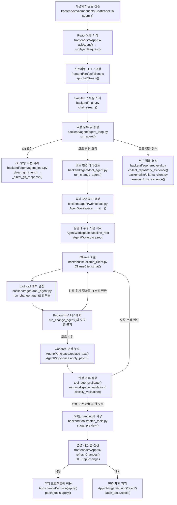

# AURA Agent 실행 흐름

이 문서는 사용자가 AURA UI에서 질문을 전송한 순간부터 Ollama 호출, 로컬 도구 실행, 변경안 검증, Diff 표시, 실제 프로젝트 적용까지 현재 코드에서 실행되는 파일과 함수를 설명한다.

핵심 원칙은 다음과 같다.

- Ollama LLM은 프로젝트 파일을 직접 읽거나 수정하지 않는다.
- LLM은 다음에 실행할 도구와 인수를 선택한다.
- 파일 검색·읽기·수정·검증은 Python 백엔드가 실행한다.
- 코드 변경은 먼저 격리 작업공간에 누적한다.
- 사용자가 변경 제안에서 적용을 선택해야 실제 프로젝트 파일이 변경된다.
- 프런트엔드는 현재 열려 있는 코드 파일을 에이전트 요청에 포함하지 않는다. 현재 요청 본문은 `message`와 `model`뿐이다.

## 1. 전체 호출 흐름과 담당 함수



## 2. Mermaid 노드별 정확한 코드 위치

| 노드 | 파일 | 함수 또는 코드 구간 | 역할 |
|---|---|---|---|
| A | `frontend/src/components/ChatPanel.tsx` | `submit()` | 입력 폼 전송을 가로채고 부모의 `onSubmit()`을 호출한다. |
| B | `frontend/src/App.tsx` | `askAgent()`, `runAgentRequest()` | 사용자 메시지를 UI에 추가하고 `AbortController`를 만든 뒤 API 요청을 시작한다. |
| C | `frontend/src/api/client.ts` | `api.chatStream()` | `{message, model}`을 `/api/agent/chat/stream`으로 보내고 NDJSON 응답을 한 줄씩 처리한다. |
| D | `backend/main.py` | `chat_stream()` | `run_agent()`를 비동기 태스크로 실행하고 상태 이벤트, heartbeat, 최종 결과를 스트리밍한다. |
| E | `backend/agent/agent_loop.py` | `run_agent()` | 프로젝트 확인, 대화 기억 로드, Git/변경/질문 분기, 전체 시간 제한을 담당한다. |
| 설정 | `backend/services/app_settings.py`, `config/settings.json` | `get_int_setting()`, `get_string_setting()` | JSON 설정을 읽고 범위를 검사한다. 같은 키의 환경 변수가 있으면 JSON보다 우선한다. |
| F | `backend/agent/agent_loop.py` | `_direct_git_intent()`, `_direct_git_response()` | Git 요청을 해석하고 전용 Git 도구를 직접 실행한다. 이 분기는 일반 Ollama 도구 루프를 거치지 않는다. |
| G | `backend/agent/tool_agent.py` | `run_change_agent()` | 한 Ollama 대화 안에서 검색, 읽기, 수정, 검증, 수정 재시도를 반복한다. |
| H | `backend/agent/retrieval.py`, `backend/llm/ollama_client.py` | `collect_repository_evidence()`, `answer_from_evidence()` | 코드 질문과 원인 분석에 필요한 실제 저장소 근거를 수집하고 그 근거만 사용해 답변한다. 근거가 부족하면 `run_agent()`의 탐색 도구 루프로 넘어간다. |
| I/J | `backend/agent/workspace.py` | `AgentWorkspace.__init__()` | `.aura-workspaces/task-*` 아래에 `baseline`과 `worktree`를 만든다. |
| K | `backend/llm/ollama_client.py` | `OllamaClient.chat()` | `http://localhost:11434/api/chat`에 메시지와 현재 허용 도구 목록을 전송한다. |
| L/M | `backend/agent/tool_agent.py` | `run_change_agent()` 내부 반복문과 도구별 `if/elif` 분기 | LLM의 `tool_calls`를 검증하고 해당 Python 함수를 실행한 다음 결과를 `role=tool` 메시지로 LLM에 반환한다. |
| N | `backend/agent/workspace.py` | `replace_text()`, `apply_patch()`, `revert_file()`, `preview()` | 실제 프로젝트가 아닌 격리된 `worktree`를 수정하고 `baseline`과의 Diff를 만든다. |
| O | `backend/agent/tool_agent.py`, `backend/services/proposal_validator.py` | 내부 `validate()`, `run_workspace_validation()`, `_commands()`, `classify_validation()` | 원본과 변경본의 빌드·구문 검사 결과를 비교한다. |
| P | `backend/tools/patch_tools.py` | `stage_preview()` | 파일별 원본, 변경본, 추가·삭제 줄, 검증 상태와 재시도 요청을 전역 `pending`에 저장한다. |
| Q | `backend/main.py`, `frontend/src/App.tsx` | `changes()`, `refreshChanges()` | `/api/changes`에서 `pending`을 읽어 변경 제안 탭과 DiffEditor에 표시한다. |
| R | `frontend/src/App.tsx`, `backend/main.py`, `backend/tools/patch_tools.py` | `changeDecision('apply')`, `apply_changes()`, `apply()` | 원본 충돌과 검증 확인 상태를 검사하고 실제 프로젝트에 파일을 기록한다. |
| S | 같은 파일들 | `changeDecision('reject')`, `reject_changes()`, `reject()` | 실제 프로젝트를 건드리지 않고 선택한 항목을 `pending`에서 제거한다. |

## 3. 프런트엔드 전송 과정

### 3.1 입력과 전송

`frontend/src/components/ChatPanel.tsx`의 `submit()`이 폼 기본 동작을 막고 `onSubmit()`을 호출한다. `App.tsx`는 이 콜백에 `askAgent()`를 전달한다.

```text
ChatPanel.submit()
→ props.onSubmit()
→ App.askAgent()
→ App.runAgentRequest(prompt.trim())
```

`runAgentRequest()`는 다음 작업을 한다.

1. 프로젝트, 모델, 요청 내용, 현재 에이전트 실행 여부를 검사한다.
2. 요청별 `AbortController`를 만든다.
3. 사용자 메시지를 채팅 UI에 추가한다.
4. `api.chatStream(request, model, onStatus, signal)`을 호출한다.
5. 성공한 도구 이벤트는 즉시 상태 메시지로 표시한다.
6. 실패 이벤트는 모았다가 최종 변경안이 없을 때 요약해서 표시한다.
7. 최종 응답 후 `refreshChanges()`를 호출한다.
8. 변경안이 있으면 변경 제안 탭으로 이동한다.

### 3.2 전송되는 데이터

`frontend/src/api/client.ts`의 `chatStream()`은 다음 데이터만 보낸다.

```json
{
  "message": "사용자 질문",
  "model": "선택한 Ollama 모델"
}
```

현재 코드 뷰어에서 선택한 파일 경로와 내용은 요청에 포함되지 않는다. 따라서 사용자가 어떤 파일을 열어 두었는지는 에이전트 검색 범위를 제한하지 않는다.

### 3.3 스트림 형식

`backend/main.py`의 `chat_stream()`은 `application/x-ndjson`으로 다음 레코드를 보낸다.

| `type` | 의미 |
|---|---|
| `started` | 요청을 접수했다. |
| `status` | 검색, 파일 읽기, 수정, 검증 등 하나의 도구 이벤트다. |
| `heartbeat` | 10초 동안 이벤트가 없을 때 연결을 유지한다. |
| `complete` | 최종 `AgentResponse`다. |
| `error` | 처리 중 예외가 발생했다. |

현재 Ollama 토큰을 그대로 스트리밍하는 구조는 아니다. `OllamaClient.chat()`은 `stream: false`로 전체 모델 응답을 받은 뒤, 백엔드가 도구 단위 진행 상황만 프런트엔드에 스트리밍한다.

## 4. 백엔드 요청 분류

`backend/agent/agent_loop.py`의 `run_agent()`가 모든 에이전트 요청의 중앙 진입점이다.

```text
run_agent()
├─ 프로젝트가 열려 있는지 `guard.root` 확인
├─ `ConversationStore.messages()`로 프로젝트별 기억 로드
├─ `_direct_git_intent()`로 Git 요청 검사
├─ `_requests_change()`로 코드 변경 요청 검사
└─ 나머지는 코드 질문·저장소 분석 경로로 처리
```

### 4.1 변경 요청 판정

`_requests_change()`는 현재 자연어 분류 모델이 아니라 키워드 방식이다. 예를 들어 `변경`, `수정`, `추가`, `삭제`, `만들어`, `change`, `replace`, `add`, `fix` 등이 포함되면 코드 변경 요청으로 분류한다.

따라서 설명 질문 안에 변경 관련 단어가 들어간 경우에도 변경 요청으로 잘못 분류될 수 있다. 이것은 현재 요청 라우터의 명확한 한계다.

### 4.2 Git 요청

Git 요청은 `_direct_git_response()`가 `backend/tools/git_tools.py`의 전용 함수를 호출한다. 상태, Diff, 스테이징, 커밋, 브랜치 조회·전환 등이 이 경로를 사용한다. Push처럼 사용자 확인이 필요한 작업은 즉시 실행하지 않고 `pending_git_action`을 프런트엔드로 반환한다.

### 4.3 코드 질문과 분석

프로젝트 코드, 함수, 파일, 경로, 오류 등에 관한 질문은 다음 순서를 사용한다.

```text
run_agent()
→ repository_map()
→ collect_repository_evidence()
→ 필요하면 OllamaClient.plan_search_terms()
→ OllamaClient.answer_from_evidence()
→ 근거 파일·식별자·한국어 응답 검증
→ 최종 답변
```

자동 근거가 부족하면 `run_agent()` 하단의 최대 12회 탐색 루프에서 `project_map`, `list_files`, `search_code`, `search_regex`, `read_file`, `read_file_range`를 Ollama가 선택한다.

## 5. 코드 변경 에이전트

코드 변경 요청은 `run_agent()`에서 즉시 `backend/agent/tool_agent.py`의 `run_change_agent()`로 전달된다. 이 조기 반환 때문에 `ollama_client.py`에 남아 있는 이전 방식의 `propose_from_evidence()`, 별도 review/repair 메서드는 현재 코드 변경 경로에서 실행되지 않는다.

### 5.1 격리 작업공간

`AgentWorkspace.__init__()`은 열린 프로젝트를 다음처럼 복사한다.

```text
.aura-workspaces/task-<임시 ID>/
├─ baseline/   변경 전 비교 기준
└─ worktree/   에이전트의 변경 누적 대상
```

제외 대상에는 `.git`, `.venv`, `node_modules`, `dist`, `build`, `bin`, `obj`, `target`, `__pycache__`, 모델 파일과 바이너리 등이 포함된다.

`with AgentWorkspace(...)` 블록이 끝나면 임시 디렉터리는 정리된다. 필요한 Diff는 정리 전에 `pending`으로 복사한다.

### 5.2 Ollama 메시지 구성

`run_change_agent()`는 다음을 합쳐 Ollama 메시지를 만든다.

- AURA의 로컬 전용 작업 규칙을 담은 system 메시지
- 프로젝트 언어, 빌드 시스템, 진입점 등의 `project_map`
- 사용자 요청에 실제로 등장하고 저장소에도 존재하는 용어 근거
- 문맥 참조가 필요한 경우에만 최근 대화 일부
- 현재 사용자 요청

일반적인 독립 변경 요청에는 과거 대화를 넣지 않는다. `방금`, `이어서`, `그 파일`처럼 이전 문맥을 가리키는 요청에서만 최근 문맥을 포함해 과거 작업이 다시 실행되는 문제를 줄인다.

### 5.3 사용 가능한 도구

| 도구 | 실행 구현 | 설명 |
|---|---|---|
| `project_map` | `run_change_agent()`에서 준비한 `public_map` 반환 | 프로젝트 종류와 구조를 확인한다. |
| `list_files` | `AgentWorkspace.list_files()` | 격리 작업공간의 텍스트 파일 목록을 가져온다. |
| `search_code` | `AgentWorkspace.search(regex=False)` | 정확한 문자열을 대소문자 구분 없이 검색한다. |
| `search_regex` | `AgentWorkspace.search(regex=True)` | 정규식으로 정의와 호출부를 검색한다. |
| `read_file` | `AgentWorkspace.read_file()` | 파일 전체를 읽는다. |
| `read_file_range` | `AgentWorkspace.read_file_range()` | 최대 500줄 범위를 읽는다. |
| `replace_text` | `AgentWorkspace.replace_text()` | 정확한 원문의 예상 개수까지 확인한 뒤 결정적으로 교체한다. |
| `apply_patch` | `AgentWorkspace.apply_patch()` | Codex 형식 또는 unified diff를 하나 이상의 파일에 적용한다. |
| `revert_file` | `AgentWorkspace.revert_file()` | 해당 작업에서 한 파일의 변경을 baseline으로 되돌린다. |
| `validate_changes` | `run_change_agent()` 내부 `validate()` | baseline과 worktree를 각각 검증해 비교한다. |
| `finish_changes` | `run_change_agent()`의 완료 분기 | 범위 검토와 최종 검증 후 현재 Diff를 확정한다. |

### 5.4 한 단계의 실제 반복

`run_change_agent()`의 한 반복은 다음과 같다.

```text
1. 현재 상태에 맞는 active_tools 계산
2. OllamaClient.chat(model, messages, active_tools)
3. 응답의 tool_calls 파싱
4. 현재 허용되지 않은 과거 도구 호출 제거
5. tool_call이 없으면 force_tool_call()로 복구 시도
6. 도구 이름과 인수 검증
7. Python이 도구 실행
8. 성공 또는 오류 결과를 role=tool 메시지로 Ollama에 추가
9. 다음 반복에서 모델이 결과를 보고 다음 도구 선택
```

구조 변경으로 판정된 요청에는 `replace_text`를 숨기고 `apply_patch`를 사용하게 한다. 수정 전에 대상 파일을 `read_file` 또는 `read_file_range`로 읽지 않았다면 백엔드가 수정 호출을 거부한다.

### 5.5 작은 모델의 도구 호출 복구

모델이 도구를 호출하지 않고 설명만 반환하면 다음 복구가 실행된다.

```text
응답 본문에서 내장 tool JSON 검색
→ OllamaClient.force_tool_call()로 JSON Schema 기반 도구 하나 재선택
→ 사용자 요청과 저장소 공통 용어에 근거한 조회 도구 fallback
→ 그래도 도구를 고르지 못하면 중단
```

동일한 읽기, 검색, 실패 도구 호출도 횟수를 세어 무한 반복을 차단한다.

### 5.6 변경 범위 보호

Python 백엔드는 모델의 제안을 그대로 신뢰하지 않는다.

- `replace_text()`는 `old`의 실제 출현 개수가 `expected_count`와 다르면 수정하지 않는다.
- `apply_patch()`는 대상 경로와 변경 전 문맥이 일치해야 한다.
- 읽지 않은 기존 파일은 수정할 수 없다.
- 사용자가 요청하지 않은 주석만 변경된 파일은 자동으로 되돌린다.
- 여러 파일이 변경되면 모델에게 전체 Diff를 다시 보여주고 불필요한 파일을 `revert_file`로 제거하게 한다.
- 동일한 실패 호출은 반복하지 못하게 한다.

## 6. 검증과 오류 수정

`finish_changes` 또는 `validate_changes`가 호출되면 `run_change_agent()` 내부의 `validate()`가 실행된다.

```text
validate()
├─ 최초 한 번 baseline에 run_workspace_validation()
├─ 현재 revision의 worktree에 run_workspace_validation()
└─ classify_validation(baseline, proposed)
```

`backend/services/proposal_validator.py`의 `_commands()`가 프로젝트 표식을 보고 고정 검증 명령을 선택한다.

| 프로젝트 표식 | 검증 명령 |
|---|---|
| `CMakeLists.txt` | CMake configure 후 build |
| `*.sln`, `*.csproj` | `dotnet build --nologo --no-restore` |
| `Cargo.toml` | `cargo check` |
| `go.mod` | `go test ./...` |
| `pom.xml` | Maven build |
| `gradlew.bat` | Gradle classes |
| `package.json`의 build script | `npm.cmd run build` |
| `pyproject.toml`, `requirements.txt` | 현재 Python으로 `compileall` |

검증 결과는 다음 상태로 분류한다.

| 상태 | 의미 |
|---|---|
| `verified` | 변경 후 검증이 성공했다. |
| `failed` | 변경 전에는 성공했지만 변경 후 실패했거나 새로운 진단이 생겼다. |
| `baseline_failed` | 원래 프로젝트도 실패했지만 변경 후 새로운 진단은 확인되지 않았다. |
| `unavailable` | 검증 구성을 찾지 못했거나 패키지·실행 환경 문제로 검증할 수 없다. |
| `scope_review_incomplete` | 여러 파일 Diff에 대한 모델의 범위 검토가 완료되지 않았다. |

검증 실패가 발생하면 기본 `agent.validation_repair_attempts=2` 범위에서 오류 메시지를 동일한 Ollama 대화로 반환해 파일을 다시 읽고 수정하게 한다. 수정에 실패해도 실제 Diff가 하나 이상 존재하면 검증 상태와 오류를 함께 변경 제안에 보존한다.

## 7. 변경 제안 저장과 UI 표시

작업 종료 시 `AgentWorkspace.preview()`가 `baseline`과 `worktree`를 비교해 파일별 원본과 변경본을 만든다. `backend/tools/patch_tools.py`의 `stage_preview()`는 이를 프로세스 메모리의 `pending` 딕셔너리에 저장한다.

저장 항목은 다음과 같다.

- 상대 파일 경로
- 변경 전 내용
- 변경 후 내용
- 파일 생성·수정·삭제 여부
- 추가 줄과 삭제 줄 수
- 검증 상태와 오류
- 다시 생성할 때 사용할 원래 요청

`backend/main.py`의 `GET /api/changes`가 `pending`을 반환한다. 프런트엔드의 `refreshChanges()`가 이를 읽어 변경 제안 탭에 표시한다. 프로젝트가 열려 있는 동안에는 별도로 2초마다 변경 목록도 동기화한다.

## 8. 실제 적용과 폐기

### 8.1 적용

```text
ChangesPanel의 적용 버튼
→ App.changeDecision('apply', paths)
→ api.apply(paths, confirmUnverified)
→ POST /api/change/apply
→ main.apply_changes()
→ patch_tools.apply()
```

`patch_tools.apply()`는 실제 파일에 쓰기 전에 다음을 다시 검사한다.

1. 선택한 경로가 현재 `pending`에 존재하는가.
2. 변경안 생성 이후 실제 원본 파일이 달라지지 않았는가.
3. 새 파일을 만들 경로에 다른 파일이 생기지 않았는가.
4. 검증 실패 또는 범위 검토 미완료 상태라면 사용자가 명시적으로 확인했는가.

검사를 통과한 뒤에만 `guard.resolve(path)`로 실제 프로젝트 경로를 구하고 파일을 기록하거나 삭제한다.

### 8.2 폐기

```text
ChangesPanel의 폐기 버튼
→ App.changeDecision('reject', paths)
→ api.reject(paths)
→ POST /api/change/reject
→ main.reject_changes()
→ patch_tools.reject()
```

폐기는 실제 프로젝트 파일을 변경하지 않고 선택한 항목을 `pending`에서 제거한다.

## 9. 대화 기억

`backend/services/conversation_store.py`의 `ConversationStore`가 프로젝트별 대화를 관리한다.

기본 저장 위치는 다음과 같다.

```text
%LOCALAPPDATA%\AURA\conversations.json
```

- 프로젝트 절대 경로의 SHA-256 해시를 키로 사용한다.
- 프로젝트별 최대 100개 메시지를 저장한다.
- LLM 문맥에는 기본적으로 최근 최대 16개, 총 `conversation.history_max_chars=30000`자까지 사용한다.
- 격리 작업은 시작했지만 변경 제안을 만들지 못한 실패 턴은 기억에 저장하지 않는다.
- 저장된 실패 응답도 다음 요청 문맥에서 다시 걸러낸다.
- UI의 `대화 초기화`는 현재 프로젝트의 기억만 삭제한다.

## 10. 중지, 반복 횟수와 시간 제한

| 제한 | 코드 위치 | JSON 설정과 현재값 | 환경 변수 재정의 |
|---|---|---|---|
| Ollama 컨텍스트 크기 | `OllamaClient.__init__()` | `ollama.num_ctx=16384`, 허용 범위 4096~131072 | `OLLAMA_NUM_CTX` |
| 전체 코드 변경 작업 시간 | `agent_loop.run_agent()`의 `asyncio.wait_for()` | `agent.timeout_seconds=300`, 허용 범위 60~600초 | `AURA_AGENT_TIMEOUT_SECONDS` |
| 변경 에이전트 단계 수 | `tool_agent.run_change_agent()` | `agent.max_steps=24`, 허용 범위 4~30회 | `AURA_AGENT_MAX_STEPS` |
| 검증 실패 후 수정 기회 | `tool_agent.run_change_agent()` | `agent.validation_repair_attempts=2`, 허용 범위 0~5회 | `AURA_VALIDATION_REPAIR_ATTEMPTS` |
| 한 검증 명령 | `proposal_validator._run_validation()` | 240초 | 없음 |
| Ollama 일반 도구 응답 HTTP 제한 | `OllamaClient.chat()` | 600초 | 없음 |
| 강제 도구 선택 응답 제한 | `OllamaClient.force_tool_call()` | 90초 | 없음 |

코드 변경 작업에서는 바깥쪽 300초 제한이 전체 작업을 감싸므로, 내부 Ollama 또는 검증 함수의 개별 제한이 더 길어도 현재 설정에서는 300초가 실질적인 총 제한이다. 이 값들은 저장소 루트의 `config/settings.json`에서 관리한다.

프런트엔드 중지 버튼은 `App.stopAgent()`에서 현재 `AbortController.abort()`를 호출한다. 브라우저 스트림이 닫히면 `backend/main.py`의 `chat_stream()` 정리 구간이 아직 실행 중인 에이전트 태스크를 취소한다.

## 11. 현재 활성 경로와 남아 있는 이전 코드

현재 코드 변경의 활성 경로는 다음 하나다.

```text
run_agent()
→ _requests_change(message) == True
→ run_change_agent()
→ AgentWorkspace + 지속형 Ollama 도구 루프
```

`backend/llm/ollama_client.py`에는 `propose_from_evidence()`, 별도 변경 검토와 repair 함수 등 이전 변경 생성 방식이 남아 있다. 하지만 현재 `run_agent()`는 변경 요청을 `run_change_agent()`에서 처리한 뒤 바로 반환하므로 이 이전 변경 생성 경로에는 도달하지 않는다. 코드 질문의 근거 답변에 사용하는 `answer_from_evidence()`는 현재도 활성 상태다.

## 12. 전체 파일 책임 요약

| 파일 | 책임 |
|---|---|
| `frontend/src/components/ChatPanel.tsx` | 사용자 입력, 전송, 중지, 대화 초기화 UI |
| `frontend/src/App.tsx` | 에이전트 요청 상태, 진행 메시지, 변경 제안 갱신, 적용·폐기 orchestration |
| `frontend/src/api/client.ts` | FastAPI HTTP·NDJSON 클라이언트 |
| `backend/main.py` | FastAPI 라우트와 스트리밍 응답 |
| `backend/agent/agent_loop.py` | 요청 분류, Git 직접 경로, 질문 답변 경로, 변경 에이전트 진입, 대화 저장 |
| `backend/agent/tool_agent.py` | 지속형 Ollama 변경 도구 루프와 안전장치 |
| `backend/agent/workspace.py` | 격리된 baseline/worktree, 검색·읽기·수정·Diff |
| `backend/agent/retrieval.py` | 저장소 질문용 자동 코드 근거 수집 |
| `backend/llm/ollama_client.py` | 로컬 Ollama API 호출, 도구 호출 복구, 근거 기반 답변 |
| `backend/services/app_settings.py` | `config/settings.json` 로드, 정수 범위 검사, 환경 변수 재정의 |
| `backend/services/proposal_validator.py` | 프로젝트별 검증 명령 선택과 baseline/worktree 결과 비교 |
| `backend/services/conversation_store.py` | 프로젝트별 대화 기억 저장 |
| `backend/tools/patch_tools.py` | 변경 제안 `pending`, 실제 적용과 폐기 |
| `backend/tools/git_tools.py` | 승인된 Git 작업 실행 |
| `frontend/src/components/TerminalPanel.tsx` | 사용자가 선택한 CMD/PowerShell/Git Bash 명령과 현재 cwd UI |
| `backend/tools/terminal_tools.py` | Agent와 분리된 사용자 터미널 명령 실행과 cwd 추적 |
| `backend/security/path_guard.py` | 열린 프로젝트 밖 경로 접근 방지 |
| `config/settings.json` | Ollama 주소·컨텍스트, Agent 제한, 근거와 대화 문맥 설정 |

모든 Ollama 요청, 코드 검색, 격리 변경, 검증과 Diff는 로컬 PC 안에서 처리된다.

수동 터미널은 이 Agent 흐름에 포함되지 않는다. 터미널은 사용자가 직접 입력한 임의 셸 명령을 별도 `/api/terminal` 경로로 실행하며, 현재 프로젝트 밖 디렉터리 이동도 허용한다. 따라서 Agent의 프로젝트 경로 제한과 같은 보안 경계를 가진 것으로 간주하면 안 된다.
